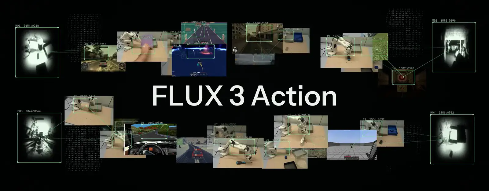

# FLUX 3 Action

Standalone full fine-tuning and action prediction for FLUX 3 Action.
The package includes data preparation, distributed training, checkpoint/resume, export and inference.
SO-101 task LoRA uses the linked LeRobot integration.

`transformer.py`, `transformer_inf_bf16.py` and `transformer_inf_fp8r.py` keep training and inference implementations separate so readers, especially coding agents, can follow each path directly without tracing inheritance or configuration branches.

The [FLUX 3 Action collection](https://huggingface.co/collections/black-forest-labs/flux-3-action)
contains separate [DROID](https://huggingface.co/black-forest-labs/flux-3-action-droid) and
[SO-101](https://huggingface.co/black-forest-labs/flux-3-action-so101) policy repositories.
Their frozen encoders are shared through the [base repository](https://huggingface.co/black-forest-labs/flux-3-action-base).

DROID offers BF16 and FP8r packages for base, guidance-distilled and single-step inference.

| Recipe | BF16 subfolder | FP8r subfolder |
|---|---|---|
| Base: 4 steps with guidance | root (omit subfolder) | `variants/fp8r` |
| Guidance-distilled: 4 steps | `variants/gd` | `variants/gd-fp8r` |
| Step-distilled: 1 step | `variants/sd` | `variants/sd-fp8r` |

Standalone FLUX Action supports all six packages. BF16 packages also include LeRobot configs;
native FP8r packages require FLUX Action. LeRobot reads `config.json`; FLUX Action reads
`config.native.json` when present, otherwise `config.json`.
See [checkpoint selection](docs/setup.md#choose-a-checkpoint) for commands.

## Get started

| Guide | What you’ll do |
|---|---|
| [Setup & inference](docs/setup.md) | Install dependencies, download weights and predict actions with DROID or SO-101 |
| [DROID full fine-tuning](docs/droid-finetune.md) | Prepare DROID data, run the reproduction recipe, resume and export |
| [SO-101 LoRA](docs/so101-lora.md) | Adapt the prepared SO-101 checkpoint to your task with LeRobot |
| [Custom tasks and embodiments](docs/embodiments.md) | Define your own observations and actions, using games as a worked example |
| [G1/Dex3 inference](docs/dex3_inference.md) | Load the trained LoRA policy and turn synchronized observations into action chunks |
