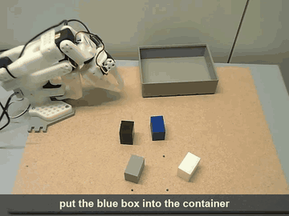
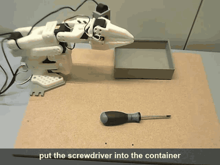
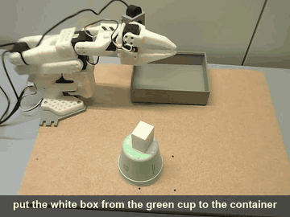
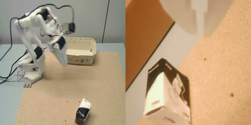

# SO-101 task LoRA via LeRobot

Download a prepared SO-101 base and adapt it with LeRobot's trainer and inference APIs.
Use the shared `examples/flux3/lora.json` training configuration and the checkpoint's saved
model and processor settings. This workflow uses LeRobot's trainer and adapter loader;
standalone `flux-action` provides full fine-tuning and base-policy inference.

The implementation is pinned to LeRobot
[`c027ee36`](https://github.com/huggingface/collab-lerobot-nv-bfl-flux3/tree/c027ee363363f8d86767c66786c6891478564d6c).

This guide includes the LeRobot installation steps in a separate environment.
See the shared setup guide for [checkpoint formats](setup.md#choose-a-checkpoint).

## Examples

| Color selection | Screwdriver | Box on a cup |
|---|---|---|
|  |  |  |

*Playback at 4× speed, with pauses removed. Each clip shows the instruction given to the robot.*

## Inputs and camera layout

- Access to [black-forest-labs/flux-3-action-so101](https://huggingface.co/black-forest-labs/flux-3-action-so101)
  and its shared encoders in [black-forest-labs/flux-3-action-base](https://huggingface.co/black-forest-labs/flux-3-action-base),
  or your own compatible checkpoint and encoders.
- A 30 Hz LeRobot dataset: six absolute command channels and six measured-state
  channels in matching units/order, gripper last.
- Two separate camera streams: a fixed top/scene camera and a wrist-mounted camera.
  See the exact key mapping and tiling example below.

The prepared model package contains the pre/postprocessor JSONs and quantile safetensors
for task LoRA; these statistics stay fixed during training. No separate statistics file is needed.
They are a choice for this adaptation workflow, not universal SO-101 calibration
values: the upstream full-finetune used per-dataset normalization; see the
[historical dataset bounds](../configs/so101/community_corpus.json). Use consistent
joint order/units/calibration. If adapting with a different normalization, choose it
before training and keep it for that adapter's inference and resume.

## SO-101 camera keys and tiling

The delivered package names cameras for their physical roles:

| Physical camera | Key expected by the model | Position in the tiled image |
|---|---|---|
| Fixed top/scene camera overlooking the workspace | `observation.images.scene` | Left |
| Wrist-mounted camera moving with the gripper | `observation.images.wrist` | Right |

The prepared base uses this exact order:

```json
{
  "camera_layout": "side_by_side",
  "camera_keys": ["observation.images.scene", "observation.images.wrist"]
}
```

Each input view is resized to 256 pixels wide × 256 pixels high. The policy joins
them horizontally before VAE encoding:



*Recorded SO-101 preflight camera pair, resized and tiled by the integration's
`materialize_video` function: 512 × 256 pixels. Left = scene; right = wrist.*

Supply two separate streams; do not pre-tile the dataset or live camera frames.
The same mapping applies during training and robot rollout. The names do not
identify camera hardware automatically: connect each physical camera to the role
shown above, even if your own setup calls the external camera “front”.

If your dataset uses different names, map them to the checkpoint keys when training.
For example, when `top` is the scene view and `gripper_cam` is the wrist view:

```bash
--rename_map='{"observation.images.top":"observation.images.scene","observation.images.gripper_cam":"observation.images.wrist"}'
```

During rollout, supply those same source keys to the saved preprocessor, or configure
its rename map to match your live camera keys. Renaming only changes labels; it
does not detect a swapped camera. Inspect the tiled image immediately before VAE
encoding: the workspace overview must be on the left and the wrist view on the right.

## Set up and download the base

Use Linux with an NVIDIA GPU, a driver compatible with CUDA 12.8, and `uv` installed.
Install FFmpeg for dataset video decoding (on Ubuntu: `sudo apt install ffmpeg`).
LeRobot is installed in its own Python 3.12 environment, separate from the `flux-action` one.

From this repository's root, check out the pinned LeRobot commit and create that environment
with the training, FLUX Action, PEFT and EMA extras from the pinned
[LeRobot setup instructions](https://github.com/huggingface/collab-lerobot-nv-bfl-flux3/blob/c027ee363363f8d86767c66786c6891478564d6c/docs/source/flux3.mdx#installation):

```sh
git clone https://github.com/huggingface/collab-lerobot-nv-bfl-flux3.git ../lerobot-so101
cd ../lerobot-so101
git checkout c027ee363363f8d86767c66786c6891478564d6c
uv venv --python 3.12 .venv
source .venv/bin/activate
uv pip install -e ".[training,flux3,peft,diffusion]"
python -c "import torch; print(torch.__version__, torch.cuda.is_available())"
```

The LeRobot checkout pins its own PyTorch (2.11 at this commit). Install the NATTEN wheel whose
suffix matches the torch and CUDA versions printed above, for example:

```sh
uv pip install 'natten==0.21.6+torch2110cu128' -f https://whl.natten.org/
```

The remaining commands in this guide run inside this activated environment.
Download the policy package and shared encoders:

```sh
hf auth login
hf download black-forest-labs/flux-3-action-so101 \
  --revision c9e13b2aca6a0a472b3ea03fd90cff32d3e85849 \
  --local-dir models/flux-3-action-so101
hf download black-forest-labs/flux-3-action-base \
  --revision 62878e2925e59b7a89ec14463ce89932624c490d \
  --include 'video_vae.safetensors' --include 'text_encoder/*' \
  --local-dir models/flux-3-action-base
policy_dir="$(pwd)/models/flux-3-action-so101"
encoders_dir="$(pwd)/models/flux-3-action-base"
```

The SO-101 directory contains the policy, saved processors, normalization statistics and `lora.json`.
The base directory contains the VAE and text encoder, downloaded at the revision referenced by
the policy config. The pinned LeRobot training command below supplies these shared encoders as
local absolute paths. Keep both directories available for adapter inference and resume.
No demonstration dataset is included; supply your own.

The training configuration is `examples/flux3/lora.json` in the LeRobot checkout. It holds only
training settings (LoRA rank, optimizer, EMA, batch and step budget); everything about the robot
comes from the checkpoint passed as `--policy.path`. The Hub package bundles an identical copy
of the file for reference. The command below uses the checkout's copy.

The pinned policy uses eight observation timesteps, two visual snapshots and past-command/state
conditioning. It predicts 42 actions and executes the first 32 at 30 Hz before replanning.
Euler sampling, four steps, guidance 3/3 and shift 6.93 come from the checkpoint.
Use the saved processors and normalization statistics from the same checkpoint.

> **Explore richer conditioning:** Beyond current images and state, try recent camera frames,
> state history or previous commands. The LeRobot integration exposes `n_obs_steps`,
> `history_snapshots` and `condition_on_past_actions` for these experiments, with compatible
> model/processor settings and fine-tuning. Standalone inference reads this history contract
> from the delivered package. Keep its saved settings for ordinary task adaptation; evaluate
> changes to conditioning on your task.

## Train and resume

```sh
python -m lerobot.scripts.lerobot_train \
  --config_path=examples/flux3/lora.json \
  --policy.path="$policy_dir" --policy.device=cuda \
  --policy.video_vae_id="$encoders_dir/video_vae.safetensors" \
  --policy.text_encoder_id="$encoders_dir/text_encoder" \
  --dataset.repo_id=YOUR_ORG/YOUR_SO101_DATASET \
  --output_dir=outputs/so101_lora
```

The preset uses rank/alpha 32, constant adapter/head LRs 1e-4/5e-4, BF16,
activation checkpointing and EMA 0.999. Heads train in full. The top-level `peft`
config creates adapters; omit `--policy.use_peft=true` on the first run because
that flag loads an existing adapter.

The shared example uses one GPU, batch 2 and accumulation 4: effective batch 8.
`steps=10000` counts microbatches: 2500 optimizer updates, each with one EMA update.
Increase the budget or GPU count explicitly for your dataset; evaluate raw and EMA adapters
separately. Robot settings remain owned by the checkpoint.

Resume from the raw checkpoint:

```sh
lerobot-train \
  --config_path=outputs/so101_lora/checkpoints/last/pretrained_model/train_config.json \
  --resume=true
```

Evaluate both `pretrained_model` and `pretrained_model_ema` before choosing one for inference;
keep the base and encoders accessible.
The pinned
[LeRobot inference guide](https://github.com/huggingface/collab-lerobot-nv-bfl-flux3/blob/c027ee363363f8d86767c66786c6891478564d6c/docs/source/flux3.mdx#inference)
covers policy loading, saved processors and reset behavior. Run the policy and both processors
on every control tick, then reset all three between episodes.

## Optional: full fine-tuning

To train all model weights from the action-pretrained base, use the standalone
[`configs/so101/train.json`](../configs/so101/train.json). This workflow uses the `flux-action`
environment and repository root; complete [setup and the base download](setup.md#download-for-full-fine-tuning).
It initializes a fresh six-channel action head and a twelve-channel history-conditioning head,
and computes normalization from your dataset. Training uses the same history packing as the
current checkpoint: eight observed ticks, two independent visual snapshots, past commands,
and 42 future video frames/actions. Inference executes the first 32 actions before replanning.
The LoRA workflow above instead retains its prepared checkpoint and saved processors.

Use a local LeRobot v2.1 or v3.0 dataset at 30 Hz with six measured-state and absolute-command
channels: five arm joints in degrees, then the gripper in consistent recorded units.
Map your scene and wrist cameras to the standalone config's `scene` and `wrist` streams:

```sh
uv run hf download <user>/<repo> --repo-type dataset --revision <commit> \
  --local-dir outputs/so101/source
uv run flux-action index-lerobot --source-root outputs/so101/source --output-dir outputs/so101/index \
  --camera scene=observation.images.top --camera wrist=observation.images.wrist \
  --dataset-id <user>/<repo> --revision <commit> --chunk-size 42 --val-episodes 10
```

Choose a smaller holdout for small datasets. Keep the index's `manifest.json`, `rows.f32.npy`
and `statistics.json` together. The trainer reads state/action quantiles from `statistics.json`;
these cover both training and held-out episodes. Five joint targets are consecutive command deltas;
the gripper stays absolute. Each training window contains 50 camera frames: eight observed ticks
followed by 42 future frames, with scene left and wrist right on a 256 × 512 canvas. The first
future action is relative to the last history command. Windows need complete history within one
episode: a window start needs eight recorded ticks before it and 42 frames from it, all inside one
keep range, so an episode (or a keep range left by `--strip-dead-windows`) must span at least
50 frames, about 1.7 s at 30 Hz. Shorter ones are dropped silently from training; if too few
remain, the trainer stops with a message that counts them. Check `n_frames` in the index's
`manifest.json` if your dataset holds very short episodes.

The config uses separate video/action noise schedules, visual conditioning noise up to 0.2,
and per-modality loss weights 1.0/0.5 with gripper channel weight 2, matching collab's history setup.
It retains 20% wrist dropout and the full-finetuning optimizer schedule. History visual snapshots
and future clips are encoded independently, and captions use a fixed 320-token context.

For one 8-GPU node, this command retains the 512-window global batch:

```sh
uv run torchrun --nproc_per_node 8 -m flux_action.cli train --config configs/so101/train.json \
  --override grad_accumulation=4 --override visits_per_epoch=16
```

Each episode visit draws a fresh window. Adjust `visits_per_epoch` for your dataset and loader
so an epoch can supply an optimizer update. Follow the [shared training, resume and export
workflow](droid-finetune.md#run-the-reproduction), using the SO-101 config and `outputs/so101/run-seed42`
paths. This config runs 10,000 optimizer updates, saves every 500, and uses `reseed_on_resume=false`.
Preserve its normalization, sampling settings and loader topology when resuming.

After exporting a checkpoint to `outputs/so101/export`, evaluate held-out windows with:

```sh
uv run flux-action evaluate --checkpoint outputs/so101/export \
  --source-root outputs/so101/source --index-dir outputs/so101/index \
  --setting sampler=euler --setting num_inference_steps=4 \
  --setting sampler_shift=6.93 --setting guidance_scale=3.0
```

Standalone exports retain their history settings and dataset normalization. Offline evaluation
supplies recorded history and integrates predicted deltas onto its last command. This example trains
one dataset per index; it does not reconstruct the historical merged corpus, camera-quality filtering
or sampling distribution. Offline error does not establish robot task success.
