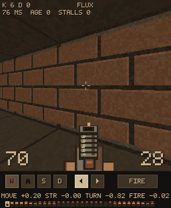

# FLUX Action plays games

This example trains one FLUX Action checkpoint on two browser games, a first-person shooter (GRUNT) and a road
racer (VECTOR), through `flux-action train` with the [embodiment settings](../../docs/embodiments.md). The
caption tells the model which game it is playing. It is an example, not part of the DROID recipe.

Both games are deterministic (seed to identical episode) and have a scripted bot that records the training data.

<p align="center">
  
  
</p>

*The same checkpoint on both games, step 3000, seed 5001. Under each frame: the keys the model is pressing, the
raw action values, and its 32-step plan.*

| Game | Action dimensions |
|---|---|
| GRUNT | Move, strafe, turn, fire |
| VECTOR | Steer, throttle, nitro (padded to four dimensions) |

## Files

- `dataset.py`: the trainer plug (`TrainConfig.dataset = "examples.games.dataset:build"`). Reads each game's
  recorded episodes, one `index.json` plus one `.npz` per episode with `frames (T, 256, 256, 3)` uint8 and
  `action (T, D)` float32 at 15 Hz. One window is 33 frames and 32 actions. VECTOR's 3-dim actions are zero-padded
  to 4 and masked from the loss. A third entry, `rotor`, is a drone whose caption is the episode's own flight
  instruction (`caption=None`, read from `index.json`); its data is not in this repository.
- `test_trainer_games.py`: the plug through the real trainer on synthetic data: two games mixed, padded dims
  masked from the loss, per-episode captions, exact resume.
- `../../configs/games/train.json`: the DROID recipe at 3000 steps with phases 200 / 600 / 200 and one sampler
  step. Replace `<DATA>`, `<RUNS>`, `<DEPS>`.

The games themselves (simulator, bot, recorder, player) are in their own repositories.

## Run

Complete [setup](../../docs/setup.md), including the base and encoder download, then set
the paths in the game training configuration.

```sh
# 1. record a game with its bot (in the game's repo) -> data/<game>/index.json + ep_*.npz
# 2. train (edit the paths in configs/games/train.json)
torchrun --nproc_per_node 8 -m flux_action.cli train --config configs/games/train.json
# 3. export in bf16
flux-action export-checkpoint --checkpoint <run>/step-3000 --output <run>/export-3000-bf16 --dtype bfloat16
```

To serve, load the export with `FluxActionPolicy.from_pretrained(..., device="cuda")`, call
`policy.prepare_inference()`, and keep `num_inference_steps=1` and `single_frame_encode=true` from its
`config.json`. Use
`policy.predict_action_chunk` to return a 32-step plan. The caption selects the game; for VECTOR,
use the first three of the four action dims.
